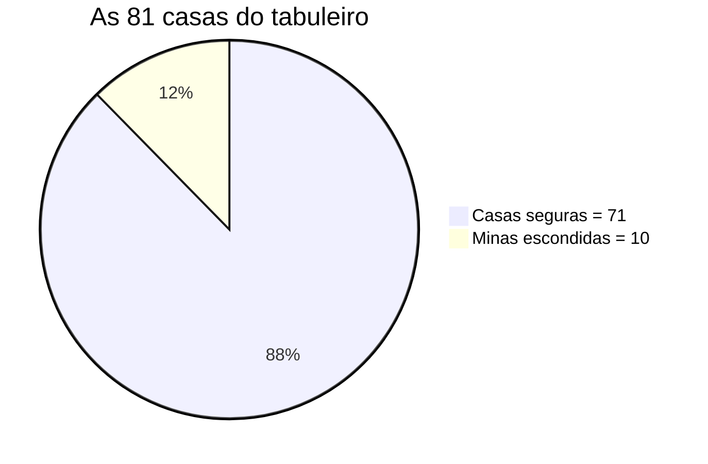
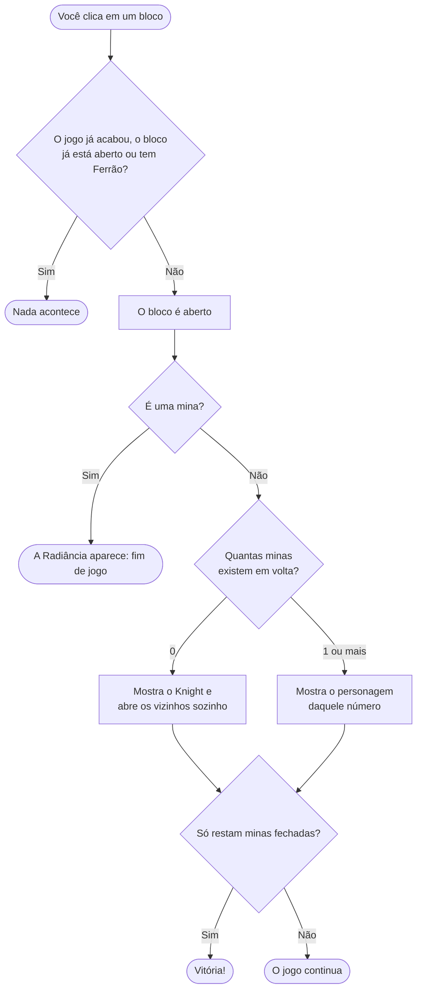

#  Campo Minado — Edição Hollow Knight

> Um Campo Minado feito em **Python (tkinter)** onde, em vez de números, você encontra os personagens de **Hollow Knight**. Explore o tabuleiro, evite acordar a **Radiância** e limpe todo o campo! feito por José Marcos e Isaque Oliveira dos santos 1 Ds Etec Euro Albino de Souza.

---

## Sumário

1. [Introdução](#1-introdução)
2. [Como o jogo funciona](#2-como-o-jogo-funciona)
3. [O que cada imagem representa](#3-o-que-cada-imagem-representa)
4. [Variáveis](#4-variáveis)
5. [Estruturas condicionais (`if`)](#5-estruturas-condicionais-if)
6. [Estruturas de repetição (`for`)](#6-estruturas-de-repetição-for)
7. [Conclusão](#7-conclusão)

---

## 1. Introdução

### Qual é o objetivo do jogo?

Você tem à frente um tabuleiro de **81 blocos fechados** (9 linhas × 9 colunas). Escondidas entre eles, há **10 minas**. O seu trabalho é **abrir todos os blocos que não têm mina**, sem nunca abrir uma que tenha.

-  **Vence** quem abre todos os 71 blocos seguros.
-  **Perde** quem abre uma mina.



Ou seja, mais ou menos **1 em cada 8 blocos** esconde perigo (10 ÷ 81 ≈ 12%).

### E o que Hollow Knight tem a ver com isso?

Em *Hollow Knight*, você controla o **Knight**, um pequeno guerreiro que explora **Hallownest**, um reino subterrâneo cheio de cavernas escuras. Cada passo pode revelar um caminho tranquilo ou um inimigo perigoso. Isso combina muito bem com o Campo Minado, em que cada bloco fechado é uma área ainda não explorada:

| No Campo Minado | No mundo de Hollow Knight |
|---|---|
| O tabuleiro | As cavernas de Hallownest |
| Abrir um bloco | Dar um passo em um lugar desconhecido |
| A mina | A **Radiância**, a ameaça final do jogo, que espalha a Infecção pelo reino |
| Os números | Personagens que você encontra e que avisam o quão perigosa é a vizinhança |
| Marcar uma suspeita | Fincar o **Ferrão**, a arma do Knight, para lembrar "aqui tem perigo" |

### Como rodar

1. Tenha o **Python 3** instalado (o `tkinter` já vem junto no Windows e no macOS; no Linux, pode ser preciso instalar o pacote `python3-tk`).
2. Abra um terminal **dentro da pasta do projeto** e execute:

```bash
python "campo minado.py"
```

### Organização dos arquivos

```
 projeto/
├──  campo minado.py     ← programa principal: cria o tabuleiro e as regras do jogo
├──  modelo/
│   └──  blocos.py       ← cada quadradinho do tabuleiro (classe Bloco)
└──  imagens/            ← os personagens, a bomba, a bandeira e a legenda
```

---

## 2. Como o jogo funciona

Ao abrir o programa, uma janela mostra o tabuleiro 9×9 com todos os blocos fechados (azul-escuro). Você joga com o mouse:

| Ação | O que acontece |
|---|---|
| **Clique esquerdo** em um bloco | O bloco é aberto. Se for mina, você perde; se não for, aparece um personagem indicando quantas minas há em volta dele |
| **Clique direito** em um bloco | Coloca (ou tira) o **Ferrão**, uma marca de "acho que tem uma mina aqui". Um bloco marcado não abre por engano |

### O que acontece a cada clique



### Quem são os "vizinhos" de um bloco?

Os **vizinhos** são os blocos que encostam no seu, contando também as diagonais. Um bloco no meio do tabuleiro tem **8 vizinhos**:

```
┌───┬───┬───┐
│ V │ V │ V │
├───┼───┼───┤
│ V │ * │ V │      * = o bloco que você abriu
├───┼───┼───┤      V = vizinho (o número mostra quantas minas há nesses 8)
│ V │ V │ V │
└───┴───┴───┘
```

Nas bordas e nos cantos há menos vizinhos, porque o tabuleiro acaba:

| Onde está o bloco | Nº de vizinhos |
|---|:---:|
| No meio | 8 |
| Na borda | 5 |
| No canto | 3 |

>  **Pense assim:** imagine um bairro onde cada casa é um bloco e em 10 delas mora um cachorro bravo. Ao chegar em uma casa segura, você encontra um bilhete na porta dizendo **quantas das casas ao redor têm cachorro bravo**. Esse bilhete é o número (aqui, um personagem de Hollow Knight).

### Exemplo passo a passo (tabuleiro pequeno 5×5, com 3 minas)

Este é o tabuleiro **escondido**, como o computador o "enxerga" (`*` = mina, os números = minas ao redor):

```
      col 0  col 1  col 2  col 3  col 4
lin 0   0      0      1      *      1
lin 1   1      1      2      1      1
lin 2   1      *      1      1      1
lin 3   1      1      1      1      *
lin 4   0      0      0      1      1
```

Observe como o **2** (linha 1, coluna 2) foi calculado: entre os 8 vizinhos dele há exatamente **2 minas** (a da linha 0/coluna 3 e a da linha 2/coluna 1).

Agora, você clica no bloco do **canto superior esquerdo** (linha 0, coluna 0). Ele é um **0**, então o jogo abre os vizinhos sozinho. Um deles, o bloco ao lado, também é 0 e abre os próprios vizinhos, e assim por diante, até esbarrar em números:

```
ANTES do clique           DEPOIS do clique
■ ■ ■ ■ ■                 0 0 1 ■ ■
■ ■ ■ ■ ■                 1 1 2 ■ ■
■ ■ ■ ■ ■                 ■ ■ ■ ■ ■
■ ■ ■ ■ ■                 ■ ■ ■ ■ ■
■ ■ ■ ■ ■                 ■ ■ ■ ■ ■
```

É o **efeito cascata** (ou efeito dominó): uma peça cai e derruba as próximas, até chegar em uma peça que não cai (um número maior que 0). É como derramar água em uma mesa: ela se espalha até encontrar as bordas.

---

## 3. O que cada imagem representa

O número que aparece em um bloco aberto diz **quantas minas existem nos vizinhos dele** (não no próprio bloco, que é seguro). Em vez do número, o jogo mostra um personagem de Hollow Knight:

| Imagem | O que significa | Personagem | Como pensar nisso |
|:---:|---|---|---|
|  | **0 minas** ao redor | **Knight** | O herói caminhando tranquilo: área totalmente segura. Por isso o jogo abre os vizinhos automaticamente |
|  | **1 mina** ao redor | **Receptáculo Puro** | Um aviso leve: há **um** perigo por perto |
|  | **2 minas** ao redor | **Cavaleiro Vazio** | Há **dois** perigos por perto: hora de prestar atenção |
|  | **3 minas** ao redor | **Receptáculo Quebrado** | **Três** perigos: a vizinhança está bem carregada |
|  | **4 minas** ao redor | **Mawlek** | **Quatro** perigos: muito cuidado |
|  | **5, 6, 7 ou 8 minas** ao redor | **Balão Infectado** | Casos raríssimos (veja o gráfico abaixo), por isso compartilham a mesma imagem |
|  | **Era uma mina!** | **Radiância** | O fim de jogo. Ao perder, todas as minas do tabuleiro são reveladas com fundo vermelho |
|  | **Marca de suspeita** (clique direito) | **Ferrão Puro** | Você espeta o Ferrão para lembrar "aqui eu desconfio de uma mina" |

> Para ver todas as imagens lado a lado, abra `imagens/legenda.png`.

### Exemplo do dia a dia: "quantos cachorros bravos há em volta?"

Na hora de ler um bloco, faça a pergunta:

- Vi o **Receptáculo Puro** (1)? Então, dos 8 blocos em volta, **só 1 esconde uma mina**.
- Vi o **Cavaleiro Vazio** (2)? Há **2 minas** entre os vizinhos.
- Vi o **Knight** (0)? **Zero minas.** Pode abrir todos os vizinhos sem medo (e o jogo já faz isso por você).

Um exemplo de raciocínio: se um bloco mostra **1** e você tem certeza de que a mina dele é o vizinho que marcou com o Ferrão, então a mina já foi "encontrada". Todos os **outros** vizinhos desse bloco são seguros!

### Outros sinais visuais do tabuleiro

| Estado do bloco | Aparência |
|---|---|
| Fechado | Fundo azul-escuro, sem desenho |
| Aberto (seguro) | Fundo azul mais claro, com o personagem do número |
| Mina revelada | Fundo **vermelho** com a Radiância |
| Marcado | Fundo azul-escuro com o Ferrão |

### Com que frequência cada personagem aparece?

Em uma simulação de **100 mil tabuleiros** (com as mesmas regras do jogo: 9×9 e 10 minas), estes foram os números médios de blocos seguros de cada tipo **por tabuleiro** (são 71 blocos seguros no total):

```
Nº   Personagem              Média por tabuleiro         % dos blocos seguros
0    Knight                  █████████████████████████████  28,7        40,4%
1    Receptáculo Puro        ████████████████████████████   28,2        39,7%
2    Cavaleiro Vazio         ███████████                    11,4        16,1%
3    Receptáculo Quebrado    ██                              2,5         3,5%
4    Mawlek                  ▏                               0,3         0,4%
5-8  Balão Infectado         ▏                              0,02        <0,1%
```

**O que isso mostra:** o Knight e o Receptáculo Puro aparecem muito, cerca de 4 em cada 5 blocos seguros. Já o Balão Infectado é uma raridade: em média, só aparece **1 vez a cada 50 tabuleiros**. Como as minas são poucas e espalhadas, é muito difícil um bloco ficar cercado por 5 ou mais delas.

---

## 4. Variáveis

Variáveis são as "caixinhas" onde o programa guarda informações. Usando a analogia do bairro, cada **bloco** é uma casa, e cada casa tem a sua "ficha" com os dados abaixo.

### A ficha de cada bloco (classe `Bloco`, em `modelo/blocos.py`)

| Variável | Tipo | O que guarda | Exemplo do dia a dia |
|---|---|---|---|
| `eBomba` | verdadeiro/falso | Este bloco **é** uma mina? | "Nesta casa mora um cachorro bravo?" |
| `revelado` | verdadeiro/falso | Este bloco **já foi aberto**? | "A porta desta casa já foi aberta?" |
| `marcado` | verdadeiro/falso | O jogador colocou o **Ferrão** aqui? | "Já colei um post-it de 'cuidado' nesta porta?" |
| `qtdBombasVizinhas` | número (0 a 8) | Quantas minas existem **nos vizinhos** | "Quantos vizinhos têm cachorro bravo?" |
| `linha` e `coluna` | número | A posição do bloco no tabuleiro | O endereço da casa (rua e número) |

> Em programação, "verdadeiro/falso" se chama **booleano** (`True` / `False`).

### As variáveis do jogo inteiro (classe `Tabuleiro`, em `campo minado.py`)

| Variável | O que guarda | Exemplo do dia a dia |
|---|---|---|
| `LINHAS`, `COLUNAS` | O tamanho do tabuleiro (**9** e **9**) | O tamanho do bairro: 9 ruas × 9 casas |
| `BOMBAS` | Quantas minas existem (**10**) | Quantas casas têm cachorro bravo |
| `self.blocos` | Uma **lista de listas** com os 81 blocos: `blocos[linha][coluna]` | A **planta do bairro**, com todas as casas nos seus lugares |
| `jogoTerminado` | O jogo já acabou (por vitória ou derrota)? | O apito final da partida: depois dele, ninguém joga mais |

### Como `self.blocos` é organizada

```
                    coluna 0   coluna 1   coluna 2   ...   coluna 8
blocos[0]  →  [    Bloco      Bloco      Bloco      ...    Bloco    ]   ← linha 0
blocos[1]  →  [    Bloco      Bloco      Bloco      ...    Bloco    ]   ← linha 1
   ...
blocos[8]  →  [    Bloco      Bloco      Bloco      ...    Bloco    ]   ← linha 8

Para chegar em um bloco: self.blocos[linha][coluna]
Exemplo: self.blocos[2][5] é o bloco da linha 2, coluna 5
```

---

## 5. Estruturas condicionais (`if`)

Um `if` é uma **decisão**: "**se** isto for verdade, faça aquilo; **senão**, faça outra coisa". É como decidir se leva o guarda-chuva: *se estiver chovendo, levo; senão, deixo em casa.*

### Onde o jogo toma decisões

| Onde | A pergunta (`if`) | Se **sim** | Se **não** |
|---|---|---|---|
| Ao clicar (`revelar`) | O jogo acabou, o bloco já está aberto **ou** tem Ferrão? | Ignora o clique | Segue adiante |
| Ao clicar (`revelar`) | O bloco é uma mina? | Mostra a Radiância e o jogador perde | Segue adiante |
| Ao clicar (`revelar`) | Há minas ao redor (`qtdBombasVizinhas > 0`)? | Mostra o personagem do número | Mostra o Knight e abre os vizinhos |
| Ao clicar com o botão direito (`alternarMarcacao`) | O bloco já estava marcado? | Tira o Ferrão | Coloca o Ferrão |
| Ao abrir os vizinhos (`revelarVizinhos`) | O vizinho está fechado **e** não é mina? | Abre o vizinho | Deixa como está |
| Ao contar vizinhos (`_vizinhos`) | A posição está dentro do tabuleiro? | Conta como vizinho | Ignora (não existe casa ali) |
| Após cada bloco aberto (`checarVitoria`) | Ainda existe algum bloco seguro fechado? | O jogo continua | O jogador venceu |

### O caminho de decisão ao clicar, em resumo

```
Clique
  │
  ├─ Jogo acabou / bloco aberto / bloco marcado? ──► ignora o clique
  │
  ├─ É mina? --> Radiância aparece, fim de jogo
  │
  ├─ Tem minas ao redor? --> mostra o personagem do número (1 a 8)
  │
  └─ Não tem nenhuma? --> mostra o Knight e abre os vizinhos (cascata)
```

>  **Um detalhe esperto:** o `if` de "está dentro do tabuleiro?" evita erros. Sem ele, o programa tentaria olhar uma casa que não existe (por exemplo, a "linha -1") ao contar os vizinhos de um bloco de canto.

---

## 6. Estruturas de repetição (`for`)

Um `for` **repete uma tarefa várias vezes** sem precisar escrever o mesmo código 81 vezes. É como um professor que faz a chamada: lê o nome de cada aluno, um por um, até acabar a lista.

### Onde o jogo repete tarefas

| Tarefa | O que o `for` faz | Quantas vezes |
|---|---|:---:|
| **Criar o tabuleiro** (`__init__`) | Percorre cada linha e, dentro dela, cada coluna, criando um bloco e colocando-o na tela | 81 |
| **Sortear as minas** (`_colocarBombas`) | Monta a lista de todas as posições e sorteia 10 delas para receberem uma mina | 10 sorteios |
| **Contar as minas ao redor** (`_calcularVizinhos`) | Passa por todos os blocos e, para cada um, olha os 8 vizinhos e conta quantos são mina | 81 blocos × até 8 vizinhos |
| **Descobrir quem são os vizinhos** (`_vizinhos`) | Testa deslocamentos de -1, 0 e +1 nas linhas e nas colunas, ou seja, as 8 direções em volta | 9 combinações (a do meio é pulada) |
| **Abrir a cascata** (`revelarVizinhos`) | Percorre os vizinhos de um bloco "0" e abre os que forem seguros | até 8 |
| **Verificar a vitória** (`checarVitoria`) | Passa por todos os blocos procurando algum seguro ainda fechado | 81 |
| **Revelar as minas ao perder** (`perder`) | Passa por todos os blocos e mostra a Radiância em cada mina | 81 |

### Repetição dentro de repetição

Para percorrer um tabuleiro, o jogo usa **dois `for` um dentro do outro**: o de fora anda pelas linhas, o de dentro anda pelas colunas de cada linha. É como ler um livro: você percorre cada **página** e, dentro de cada página, cada **linha de texto**.

```
para cada LINHA (0 até 8):
    para cada COLUNA (0 até 8):
        faz alguma coisa com o bloco [linha][coluna]
```

### O efeito dominó (a cascata) também é uma repetição

Quando você abre um bloco com **0 minas ao redor**, ele manda abrir os vizinhos; se algum deles também for **0**, esse manda abrir os **seus** vizinhos, e assim por diante. O código repete o mesmo processo em cadeia até sobrarem apenas blocos com números, que "seguram" a cascata.

```
Clique em um 0 ──► abre os vizinhos ──► algum vizinho é 0? ──► sim: abre os vizinhos dele...
                                                          └──► não: para aqui
```

---

## 7. Conclusão

Este projeto une um **clássico da lógica**, o Campo Minado, com o universo de **Hollow Knight**. Em vez de números, o jogador lê personagens: o **Knight** avisa que o caminho é seguro, a **Radiância** é o perigo que ninguém quer acordar, e o **Ferrão** vira a bandeira de suspeita.

Por baixo do visual, o código usa conceitos importantes de programação:

- **Classes** (`Bloco` e `Tabuleiro`) para organizar o jogo em partes que cuidam de coisas diferentes;
- **Variáveis** para guardar o estado de cada bloco (mina, aberto, marcado, minas ao redor);
- **Condicionais** (`if`) para tomar decisões a cada clique;
- **Repetições** (`for`) para criar, percorrer e analisar os 81 blocos.

Bom jogo, e cuidado com a Radiância! 